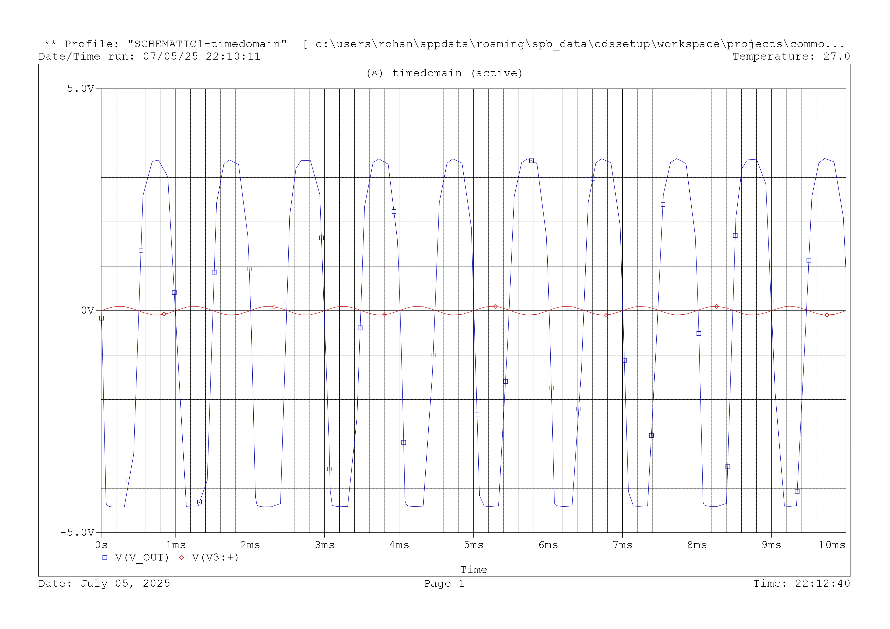

# Analog Circuits Simulation in PSpice

This repository contains analog electronic circuits designed and simulated using **PSpice Capture-CIS**.

## 📁 Projects Included

### 1. Common-Emitter Amplifier

A single-stage BJT amplifier using **2N2222** designed for mid-band voltage gain of ~20 dB.

- **DC Bias Analysis**: Verified hand-calculated operating point with ~1 mA collector current.
- **AC Sweep**: Extracted mid-band gain and –3 dB bandwidth.
- **Transient Simulation**: Demonstrated amplification of a 1 kHz sine wave.
- **With and without emitter-bypass capacitor** to show gain-bandwidth tradeoff.

📷 *Output (V_in vs V_out)*

---

### 2. Precision Full-Wave Rectifier

An op-amp-based rectifier circuit designed to accurately rectify low-voltage signals.

- **Op-Amp Used**: μA741
- **Simulation**: Transient analysis with sinusoidal input (at 100Hz)
- **Waveform Output**: Shows half-wave rectification

📷 *Sample Output:*

